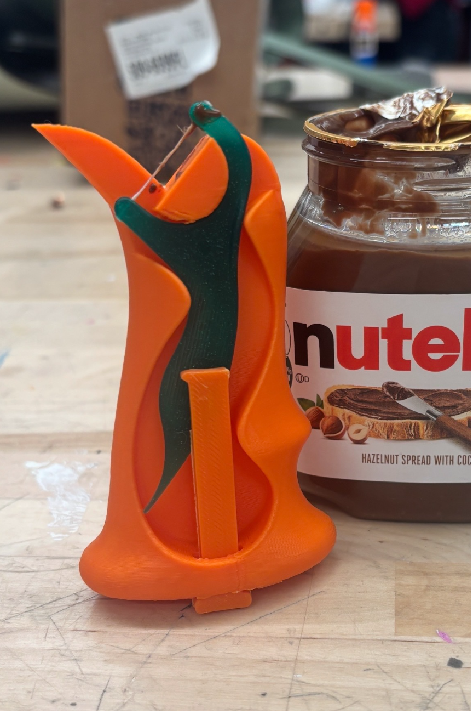
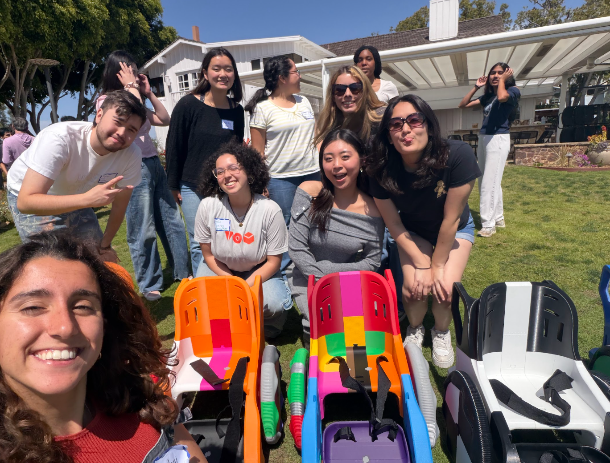
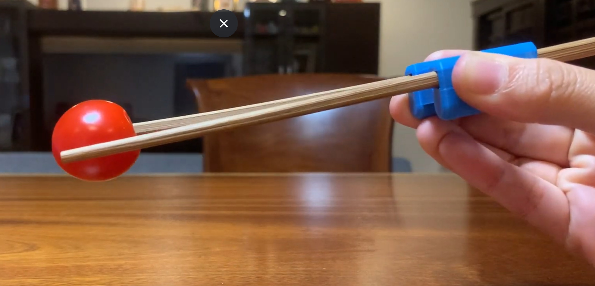
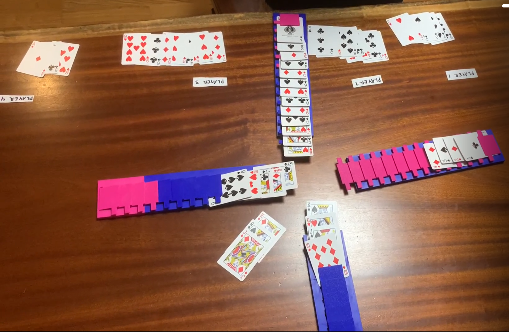
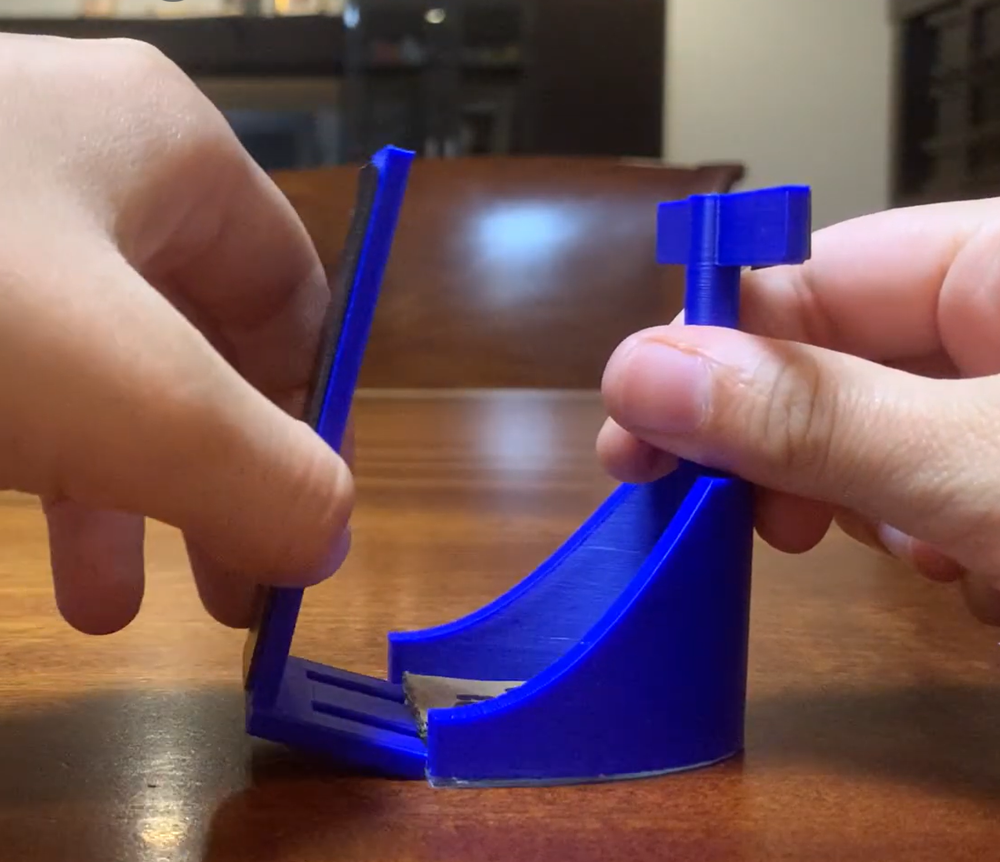

Modern assistive technology too often serves only able-bodied individuals, leaving those with physical limitations without affordable, personalized solutions. Through my involvement with Adaptive Design at Mudd (ADAM) and independently funded research, I have been working towards designing and building low-cost adaptive tools that increase the independence and dignity of individuals with disabilities.

---

## ADAM — Club Work

Adaptive Design at Mudd (ADAM) is a student-run engineering club at Harvey Mudd College focused on designing accessible tools for individuals with disabilities. As Co-President and TOM Fellow, I lead engineering teams, organize community events, and connect our work to the people who need it most.

**Role:** Co-President | TOM Fellow

**Community Impact:** 100+ children and individuals with disabilities impacted through events and tool delivery

---

### Jar Seal Opener

A lightweight seal opener designed for individuals with limited dexterity and fine motor skills.

Designed to be minimal and easy to use, this tool snaps onto jar lids and provides enough leverage to break the seal with one hand. Fabricated using PLA and sized to fit a nutella jar. 

[STL File 1](documents/sealopener.STL) 

---

### TMT Build Party

 

A community build event assembling 3D-printed toddler mobility chairs for children under 5 who do not qualify for wheelchairs under insurance.

In collaboration with TOM Fellows from across Southern California, we assembled and distributed toddler mobility chairs to community members across the region, including a local elementary school. These chairs give young children the independence to explore their environment without relying entirely on caregivers.

[TMT Build Guide](documents/TMTguide.pdf)

---

## Summer Grant Work — Ben Huppee & Strauss Community Engagement Grant

In the summer of 2025, I received the Ben Huppee & Strauss Community Engagement Grant to continue developing adaptive tools independently. Over the course of the summer, I designed, CAD-modeled, and 3D printed customized assistive devices for 50+ seniors served by AgingNext, managing all aspects of the project from research and budgeting to stakeholder coordination and final delivery.

[Poster](documents/assistivetoolposter.png)

---

### Chopsticks to Tongs Converter

A portable TPU converter that transforms standard single-use chopsticks into tongs for individuals with limited fine motor skills.

Designed for a stroke survivor with hemiplegia, this tool enables continued use of chopsticks — a preferred utensil — without expensive adaptive alternatives. Made from waterproof TPU, it is compact, durable, and sized to fit standard restaurant chopsticks.

[STL File](documents/chopsticks.STL) | [SolidWorks File](documents/chopsticks.SLDPRT)

---

### Project 2: Four Kings Card Holder

 -->

Designed for those with limited fine motor skills who enjoys playing four kings but struggle to pick up cards from off the table. 

The material is composed of PLA and requires assembly. Each divider must be plaecd in a slot for compelte assembly. The assembly was designed intentially for easy printing and easy transportation. 

[STL File 1](documnets/slotinserts.3mf) | [SolidWorks File 1](documents/slotinserts.SLDPRT)

[STL File 2](documnets/slotbase.STL) | [SolidWorks File 2](documents/slotbase.SLDPRT)

---

### Project 3: Adjustable Spoon

 

An spoon made so users can adjust the angles of the spoons rotation depending on the meal being eaten. 

This allows users who struggle with dexterity and mobility to eat with adaptive tools that are customizable for their needs. THis device is made up of TPU and a plastic spoon head from the dollar store DAISO and is dishwasher safe.

[STL File 1](documents/spoonbody.STL) | [SolidWorks File 1](documents/spoonbody.SLDPRT)

[STL File 1](documents/spoonwheel.STL) | [SolidWorks File 1](documents/spoonwheel.SLDPRT)

---

### Project 4: Puzzle Scooper

This puzzle scooper is an easy way for individausl who struggle to pick up small puzzle peices to do so with ease. 

This tool is composed of two pieces similar to a dustpan but scaled down. It is easy to print and has several hand holding options making it easy for users to hold both objects. 

[STL File 1](documents/puzzlescoop1.STL) | [SolidWorks File 1](documents/puzzlescoop1.SLDPRT)

[STL File 2](documents/puzzlescoop2.STL) | [SolidWorks File 2](documents/puzzlescoop2.SLDPRT)

