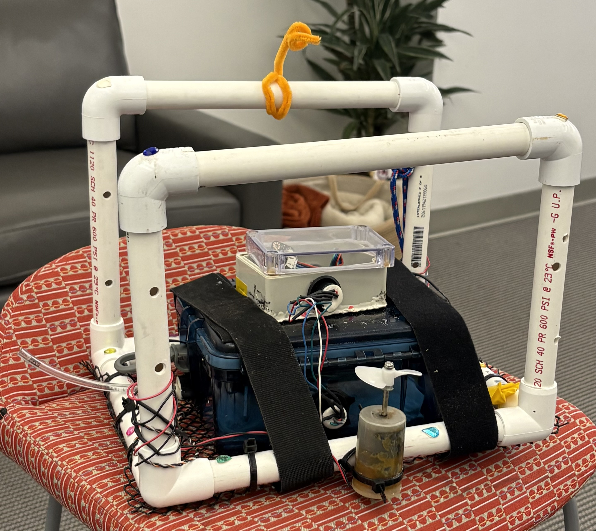
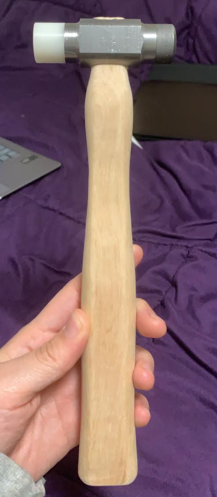
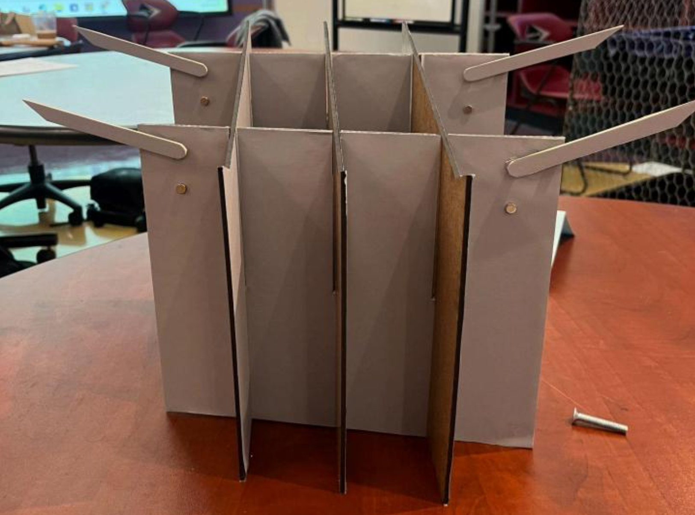

<h1 style="font-size: 2.5rem; font-weight: 700;">Nadia Qazi</h1>

Welcome to my Engineering Portfolio! I am a junior engineering student at <a href="https://www.hmc.edu/">Harvey Mudd College</a>, interested in mechanical engineering, specifically in product design engineering, industrial design, and manufacturing. I am currently a Lewis Professional Research Fellow conducting research on the effects of mechanical skin stretching and hydration on stratum corneum permeability, with the goal of improving transdermal drug delivery systems.

<a href="mailto:nadiaqazitokyo@gmail.com" style="padding: 0.5rem 1rem; border: 1px solid #1a1a1a; border-radius: 6px; text-decoration: none; color: #1a1a1a; font-size: 0.9rem;">✉ Email</a>
<a href="https://www.linkedin.com/in/nadia-qazi-a41628282/" style="padding: 0.5rem 1rem; border: 1px solid #1a1a1a; border-radius: 6px; text-decoration: none; color: #1a1a1a; font-size: 0.9rem;">LinkedIn</a>
<a href="documents/Nadia_Qazi_Resume.pdf" style="padding: 0.5rem 1rem; border: 1px solid #1a1a1a; border-radius: 6px; text-decoration: none; color: #1a1a1a; font-size: 0.9rem;">📄 Resume</a>

<h2 style="font-size: 1.6rem; font-weight: 700; border-bottom: 2px solid #1A7A4A; padding-bottom: 0.3rem; margin-top: 2rem;">Projects</h2>

<a href="class.qmd" class="project-card" style="position: relative; display: block; border-radius: 12px; overflow: hidden; text-decoration: none; color: #ffffff;">

Autonomous Underwater Vehicle

E80: Experimental Engineering

</a>
<a href="class.qmd#hammer" class="project-card" style="position: relative; display: block; border-radius: 12px; overflow: hidden; text-decoration: none; color: #ffffff;">

Machinist Hammer

E4: Manufacturing & Design

</a>
<a href="class.qmd#mobile-lectern-portal-mini-podium" class="project-card" style="position: relative; display: block; border-radius: 12px; overflow: hidden; text-decoration: none; color: #ffffff;">

Mobile Lectern

E4: Manufacturing & Design

</a>
<a href="adam.qmd" class="project-card" style="position: relative; display: block; border-radius: 12px; overflow: hidden; text-decoration: none; color: #ffffff;">

Adaptive Design

ADAM & Grant Work

</a>
<a href="research.qmd" class="project-card" style="position: relative; display: block; border-radius: 12px; overflow: hidden; text-decoration: none; color: #ffffff;">

Transdermal Research

Lewis Research Fellowship

</a>

