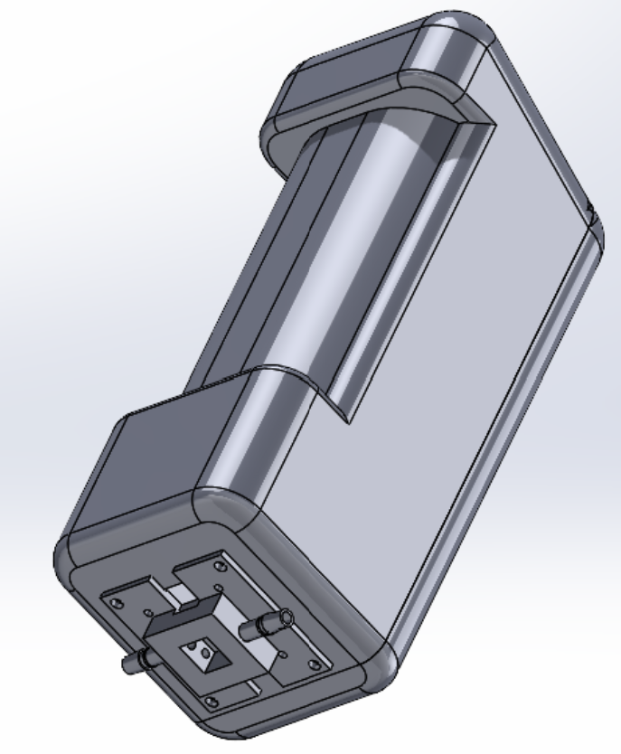
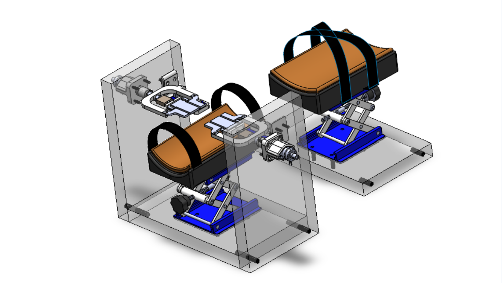

## Transdermal Transport Research Lab

**Principal Investigator:** Professor Nancy Lape | Harvey Mudd College

**Role:** Undergraduate Researcher | Lewis Professional Research Fellow

**Funded by:** The Patton and Claire Lewis Fellowship in Engineering Professional Practice, the Norman F. Sprague III M.D. Experiential Learning Fund, and the Rose Hills Foundation

Transdermal drug delivery (TDD) is a non-invasive method of drug administration that involves applying topical medications to skin at appropriate drug doses. The challenge of TDD is permeating the stratum corneum (SC), the outermost layer of the epidermis that functions as the skin’s barrier against external toxins and pathogens. Our lab investigates how mechanical stretching of the stratum corneum affects its permeability, with the goal of improving transdermal drug delivery systems. I contribute to two research subteamsubsections: the TEWL Device Development and Skin Mold Imaging in addition to the George uniaxial extensometer team.

---

## TEWL Device & Skin Mold Imaging

**Overview:**
Transepidermal water loss (TEWL) measures the passive diffusion of water vapor out of the stratum corneum and is used to characterize skin permeability. Commercial TEWL devices cost $8,000–$12,000 and fail to account for changes in skin surface area during stretching. Our team is developing a custom-built TEWL measuring device and a skin mold imaging procedure to normalize TEWL values against real surface area measurements.

**My Contributions:**
- Designed and built a custom TEWL measuring device using a relative humidity sensor, thermocouple, micropump, and 3D-printed resin chamber
- Created ExaFlex skin molds of participants under stretched and unstretched conditions
- Processed skin mold Z-stacks using Fiji and BoneJ to calculate surface area

**Skills:**
SolidWorks, Resin Printing, Circuit Design, Arduino, MATLAB, Fiji/ImageJ, Confocal Laser Scanning Microscopy (CLSM)

**Team:** [Katie Latvakoski](https://www.linkedin.com/in/katie-latvakoski-920224378/) | [Angie Hou](https://www.linkedin.com/in/angie-hou-011377348/) | Justin Huang | [Talia Green](https://www.linkedin.com/in/talia-sy-green/)

<a href="documents/TEWL_Measuring_Device_Poster_2026.pdf" style="padding: 0.5rem 1.2rem; border: 2px solid #1A7A4A; border-radius: 6px; text-decoration: none; color: #1A7A4A; font-weight: 600; font-size: 0.9rem;">📄 TEWL Poster</a>
<a href="documents/TEWL_Measuring_Device_Tech_Memo.pdf" style="padding: 0.5rem 1.2rem; border: 2px solid #1A7A4A; border-radius: 6px; text-decoration: none; color: #1A7A4A; font-weight: 600; font-size: 0.9rem;">📄 TEWL Technical Memo</a>
<a href="documents/Skin_Mold_Imaging.pdf" style="padding: 0.5rem 1.2rem; border: 2px solid #1A7A4A; border-radius: 6px; text-decoration: none; color: #1A7A4A; font-weight: 600; font-size: 0.9rem;">📄 Skin Mold Imaging Memo</a>

::: {.callout-note collapse="true"}
## Show More

### What?

- Skin mechanical properties are critical for cosmetics, scar management, and biomimetic material design. Our lab investigates how uniaxial stretching of the stratum corneum alters its permeability.
- TEWL measures the passive diffusion of water vapor out of the SC and is used as an indicator of skin barrier function and permeability.
- Commercial TEWL devices are expensive and do not account for changes in skin surface area during stretching, so our lab developed its own device and imaging procedure.

### How?

- Built a custom closed-chamber TEWL device composed of a type-K thermocouple, relative humidity sensor, micropump, 3.7V LiPo battery, and a resin-printed TEWL chamber.
- Calibrated the device using a wet-cup method, generating a calibration curve mapping RH sensor readings to TEWL values in g/(m²·h).
- Created ExaFlex skin molds from participants under stretched and unstretched conditions using a 3D-printed skin molding template.
- Imaged molds with the Zeiss LSM510 Confocal Laser Scanning Microscope (CLSM) and processed Z-stacks in Fiji using Gaussian blur, binarization, and BoneJ surface area analysis.

### Results

- Identified that the micropump produces insufficient airflow to flush the TEWL chamber — alternative pump strategies are being explored.
- Found that the RH sensor has a response time of >80s at non-standard temperatures, prompting a search for an alternative absolute humidity sensor.
- Improved image processing pipeline by implementing Auto Exposure on the CLSM, optimizing Gaussian blur sigma radius, and experimenting with binarization methods.
- Created a control skin mold with known surface area to benchmark image processing settings.

:::

---

## George — Uniaxial Extensometer

**Overview:**
George is a lab-built *in vivo* uniaxial extensometer that stretches the skin on the ventral forearm to characterize its mechanical properties. By performing creep and stress relaxation tests, the team fits fractional viscoelastic models to describe how skin deforms under force — data that has direct implications for transdermal drug delivery research.

**My Contributions:**
- Conducted creep and stress relaxation tests on participants using George
- Processed experimental data in MATLAB and fitted fractional Kelvin-Voigt (FKV) and fractional Poynting-Thomas (FPT) models to characterize skin mechanical properties
- Contributed to mechanical design updates including dual armrests, aluminum tabs, and calibration slider tool to improve test consistency and comfort

**Skills:**
MATLAB, SolidWorks, Fractional Viscoelastic Modeling, Data Analysis, Human Subjects Testing

**Team:** [Katie Latvakoski](https://www.linkedin.com/in/katie-latvakoski-920224378/) | Justin Huang | [Talia Green](https://www.linkedin.com/in/talia-sy-green/)

<a href="documents/George_Poster_pptx.pdf" style="padding: 0.5rem 1.2rem; border: 2px solid #1A7A4A; border-radius: 6px; text-decoration: none; color: #1A7A4A; font-weight: 600; font-size: 0.9rem;">📄 George Poster</a>
<a href="documents/George_Tech_Memo_2026.pdf" style="padding: 0.5rem 1.2rem; border: 2px solid #1A7A4A; border-radius: 6px; text-decoration: none; color: #1A7A4A; font-weight: 600; font-size: 0.9rem;">📄 George Techical Memorandum</a>

::: {.callout-note collapse="true"}
## Show More

### What?

- George is a lab-built uniaxial extensometer that stretches skin *in vivo* on the ventral forearm to measure its viscoelastic mechanical properties.
- Two tests are performed: creep (constant force, measuring displacement over time) and stress relaxation (constant strain, measuring force over time).
- Fractional viscoelastic models — the FKV and FPT models — are fitted to the data to characterize skin behavior with fewer parameters than standard spring-damper models.

### How?

- Conducted participant testing using George, applying 20% and 40% strain conditions.
- Processed raw sensor data in MATLAB and fitted FKV and FPT models, evaluating fit quality using normalized root mean square error (NRMSE).
- Contributed to mechanical design improvements: dual armrests for stability, aluminum tabs for consistent skin contact, and a calibration slider tool to simplify tab calibration.

### Results

- The FKV model fits stress relaxation data well, enabling interpretable comparisons of skin mechanical properties between and within participants.
- The FPT model captures the initial creep behavior but introduces ringing between 0–25 seconds — further model refinement is needed.
- Mechanical design updates improved test reliability and participant comfort, setting the stage for larger-scale data collection across age groups.

:::